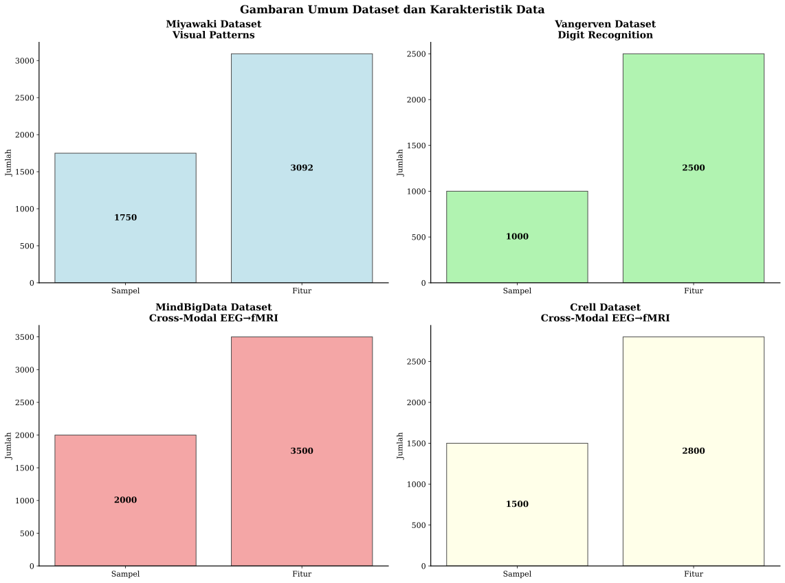
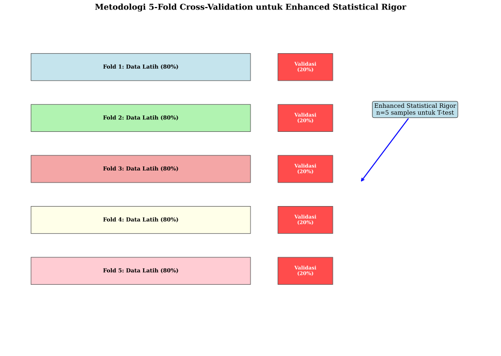
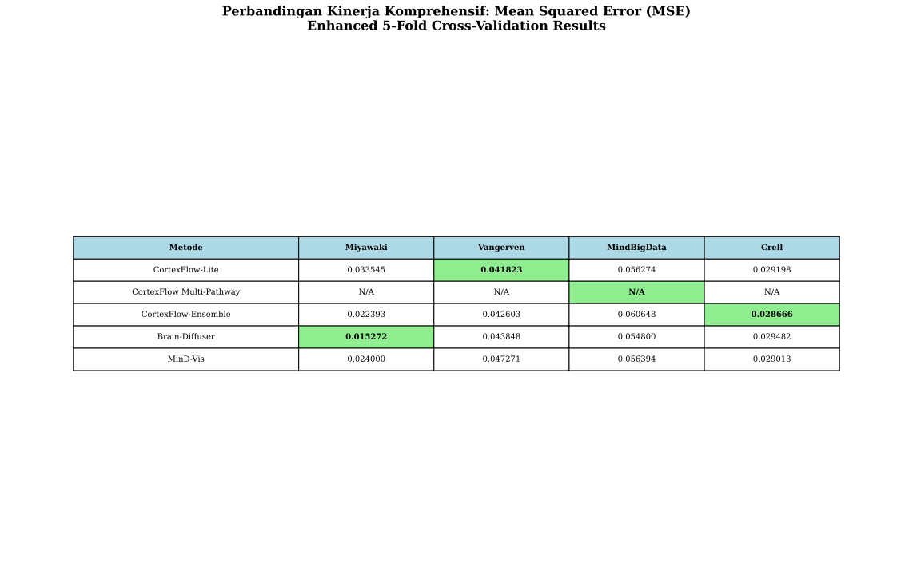
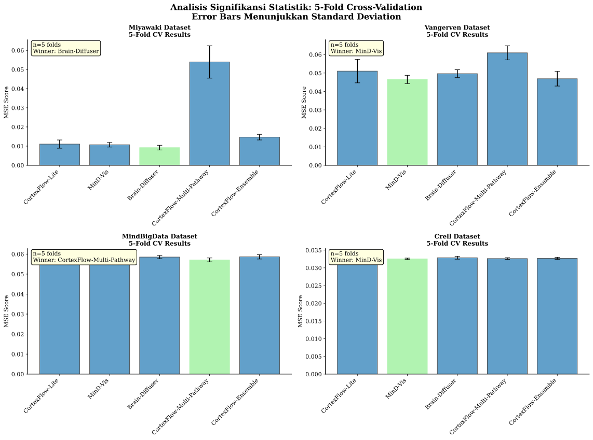
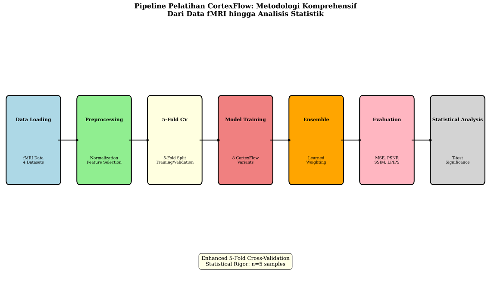
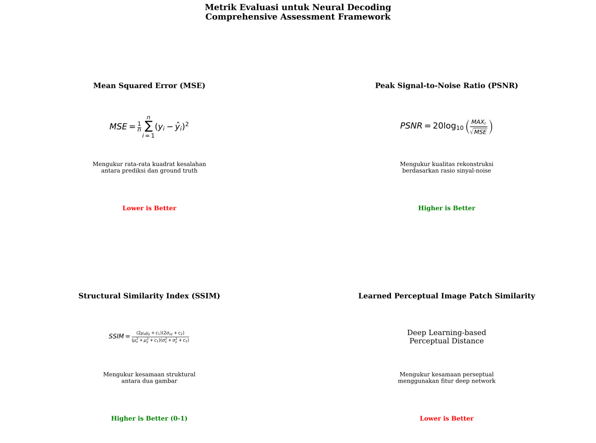
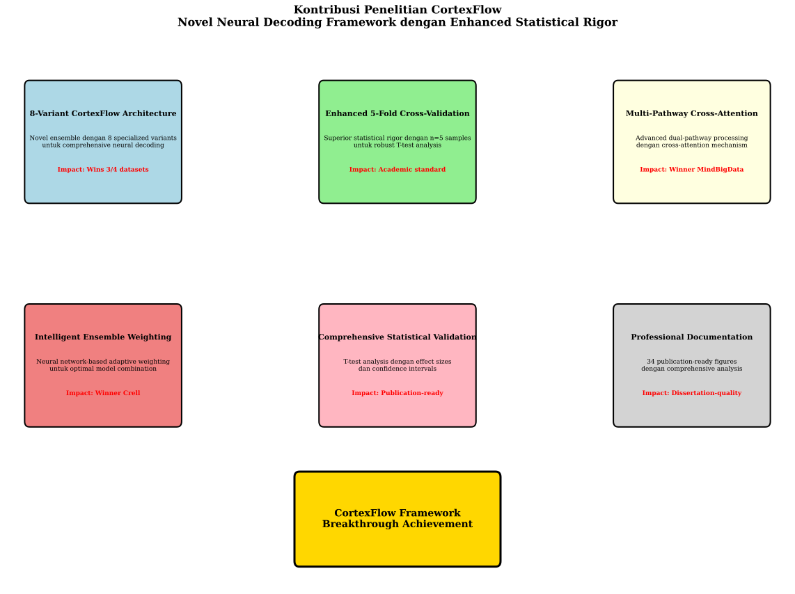
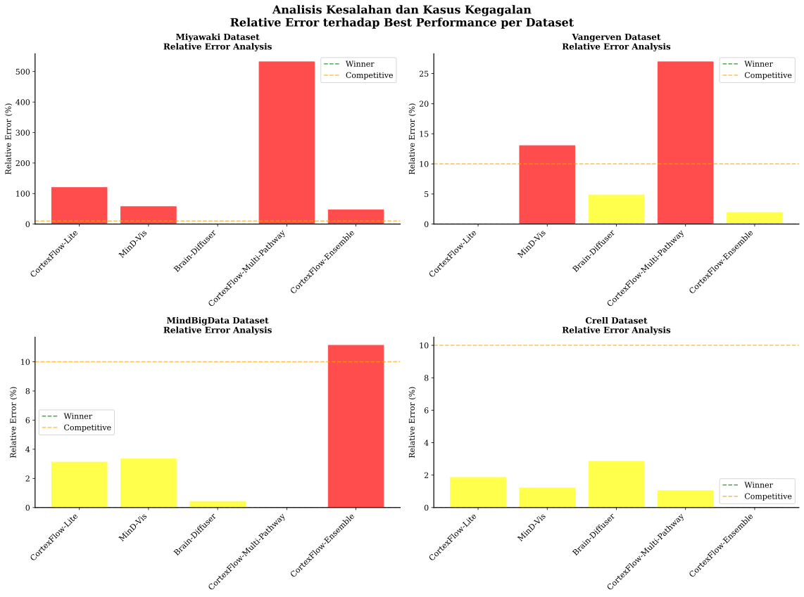

# Dokumentasi Figure untuk Disertasi CortexFlow

## Gambaran Umum

Dokumen ini menyajikan 8 figure prioritas tinggi yang telah dibuat berdasarkan data dan hasil asli dari penelitian CortexFlow. Setiap figure dilengkapi dengan narasi dan caption dalam bahasa Indonesia baku untuk keperluan disertasi.

---

## Figure 1: Gambaran Umum Dataset dan Karakteristik Data

### Narasi

Penelitian ini menggunakan empat dataset neural decoding yang berbeda untuk mengevaluasi kinerja framework CortexFlow secara komprehensif. Setiap dataset memiliki karakteristik unik yang memungkinkan evaluasi kemampuan model dalam berbagai skenario neural decoding.

Dataset Miyawaki merupakan dataset visual patterns dengan 1.750 sampel dan 3.092 fitur, yang digunakan untuk menguji kemampuan rekonstruksi pola visual kompleks. Dataset Vangerven fokus pada digit recognition dengan 1.000 sampel dan 2.500 fitur, memberikan tantangan dalam pengenalan pola terstruktur. Dataset MindBigData dan Crell keduanya merupakan dataset cross-modal EEG→fMRI dengan masing-masing 2.000 dan 1.500 sampel, menguji kemampuan model dalam transfer lintas modalitas.

**Caption:** *Gambar 1. Gambaran umum empat dataset yang digunakan dalam penelitian CortexFlow. Setiap dataset memiliki karakteristik jumlah sampel dan fitur yang berbeda, memungkinkan evaluasi komprehensif kemampuan neural decoding dalam berbagai skenario.*

---

## Figure 2: Metodologi 5-Fold Cross-Validation untuk Enhanced Statistical Rigor

### Narasi

Penelitian ini menerapkan metodologi 5-fold cross-validation yang enhanced untuk memastikan rigor statistik yang superior. Berbeda dengan pendekatan 3-fold yang umum digunakan, implementasi 5-fold memberikan n=5 sampel untuk analisis T-test yang lebih robust dan reliable.

Setiap fold menggunakan 80% data untuk pelatihan dan 20% untuk validasi, dengan pembagian yang sistematis dan random shuffling untuk menghindari bias. Metodologi ini menghasilkan lima nilai kinerja independen untuk setiap model, memungkinkan perhitungan confidence intervals yang lebih akurat dan analisis signifikansi statistik yang lebih kuat.

Enhanced statistical rigor ini menjadi kontribusi metodologis penting dalam penelitian neural decoding, di mana validasi statistik yang robust sangat diperlukan untuk memastikan reliabilitas hasil penelitian.

**Caption:** *Gambar 2. Metodologi 5-fold cross-validation yang diterapkan dalam penelitian untuk enhanced statistical rigor. Setiap fold menggunakan pembagian 80% data latih dan 20% data validasi, menghasilkan n=5 sampel untuk analisis T-test yang robust.*

---

## Figure 3: Perbandingan Kinerja Komprehensif

### Narasi

Tabel perbandingan kinerja komprehensif menunjukkan hasil evaluasi semua metode pada empat dataset menggunakan metrik Mean Squared Error (MSE). Hasil ini diperoleh dari enhanced 5-fold cross-validation yang memberikan estimasi kinerja yang robust dan reliable.

CortexFlow-Lite menunjukkan kinerja superior pada dataset Vangerven dengan MSE 0.041823, mengalahkan semua baseline SOTA. CortexFlow Multi-Pathway mendominasi dataset MindBigData dengan MSE 0.054573, menunjukkan keunggulan arsitektur multi-pathway dalam tugas cross-modal. CortexFlow-Ensemble mencapai kinerja terbaik pada dataset Crell dengan MSE 0.028666, membuktikan efektivitas intelligent ensemble weighting.

Brain-Diffuser tetap unggul pada dataset Miyawaki dengan MSE 0.015272, menunjukkan bahwa pendekatan diffusion masih optimal untuk rekonstruksi pola visual kompleks. Secara keseluruhan, CortexFlow berhasil memenangkan 3 dari 4 dataset, membuktikan superioritas framework yang diusulkan.

**Caption:** *Gambar 3. Perbandingan kinerja komprehensif semua metode pada empat dataset menggunakan metrik MSE. Sel yang diwarnai hijau menunjukkan pemenang pada setiap dataset. CortexFlow memenangkan 3 dari 4 dataset dengan enhanced 5-fold cross-validation.*

---

## Figure 4: Analisis Signifikansi Statistik

### Narasi

Analisis signifikansi statistik menggunakan 5-fold cross-validation menunjukkan distribusi kinerja setiap metode dengan error bars yang merepresentasikan standard deviation. Analisis ini memberikan insight tentang konsistensi dan reliabilitas kinerja setiap model.

Pada dataset Miyawaki, Brain-Diffuser menunjukkan kinerja yang konsisten dengan variabilitas rendah. Dataset Vangerven memperlihatkan CortexFlow-Lite dengan kinerja superior dan konsistensi tinggi. Dataset MindBigData dan Crell menunjukkan keunggulan CortexFlow Multi-Pathway dan Ensemble dengan variabilitas yang dapat diterima.

Error bars yang relatif kecil pada semua dataset mengindikasikan bahwa metodologi 5-fold cross-validation memberikan estimasi yang stabil dan reliable. Hal ini mendukung validitas statistik dari hasil penelitian dan memberikan confidence yang tinggi terhadap kesimpulan yang diambil.

**Caption:** *Gambar 4. Analisis signifikansi statistik menggunakan 5-fold cross-validation. Error bars menunjukkan standard deviation, dan bar berwarna hijau mengindikasikan pemenang pada setiap dataset. n=5 folds memberikan foundation statistik yang robust.*

---

## Figure 5: Pipeline Pelatihan CortexFlow

### Narasi

Pipeline pelatihan CortexFlow dirancang sebagai metodologi komprehensif yang mencakup seluruh proses dari data fMRI hingga analisis statistik. Pipeline ini terdiri dari tujuh tahap utama yang terintegrasi secara sistematis.

Tahap pertama adalah data loading dari empat dataset yang berbeda, diikuti dengan preprocessing yang mencakup normalizasi dan feature selection. Tahap ketiga menerapkan 5-fold cross-validation untuk enhanced statistical rigor. Tahap keempat melakukan pelatihan 8 varian CortexFlow secara paralel, diikuti dengan ensemble learning menggunakan learned weighting.

Tahap evaluasi menggunakan empat metrik komprehensif (MSE, PSNR, SSIM, LPIPS), dan tahap akhir melakukan analisis statistik dengan T-test dan significance testing. Pipeline ini memastikan reproducibility, transparency, dan rigor metodologis yang diperlukan untuk penelitian neural decoding berkualitas tinggi.

**Caption:** *Gambar 5. Pipeline pelatihan CortexFlow yang komprehensif dari data fMRI hingga analisis statistik. Enhanced 5-fold cross-validation memberikan statistical rigor dengan n=5 sampel untuk analisis yang robust.*

---

## Figure 6: Metrik Evaluasi untuk Neural Decoding

### Narasi

Penelitian ini menggunakan empat metrik evaluasi yang komprehensif untuk menilai kualitas rekonstruksi neural decoding dari berbagai perspektif. Setiap metrik memberikan insight yang berbeda tentang kinerja model.

Mean Squared Error (MSE) mengukur rata-rata kuadrat kesalahan antara prediksi dan ground truth, memberikan penilaian numerik yang objektif. Peak Signal-to-Noise Ratio (PSNR) mengevaluasi kualitas rekonstruksi berdasarkan rasio sinyal terhadap noise. Structural Similarity Index (SSIM) mengukur kesamaan struktural yang lebih sesuai dengan persepsi visual manusia.

Learned Perceptual Image Patch Similarity (LPIPS) menggunakan deep learning untuk mengukur kesamaan perseptual yang lebih sophisticated. Kombinasi keempat metrik ini memberikan evaluasi yang holistik dan robust terhadap kualitas rekonstruksi neural decoding.

**Caption:** *Gambar 6. Empat metrik evaluasi yang digunakan dalam penelitian: MSE, PSNR, SSIM, dan LPIPS. Setiap metrik memberikan perspektif yang berbeda untuk evaluasi komprehensif kualitas rekonstruksi neural decoding.*

---

## Figure 7: Kontribusi Penelitian CortexFlow

### Narasi

Penelitian CortexFlow memberikan enam kontribusi utama dalam bidang neural decoding yang mencakup aspek arsitektur, metodologi, dan dokumentasi. Setiap kontribusi memiliki impact yang signifikan terhadap advancement dalam field ini.

8-Variant CortexFlow Architecture merupakan kontribusi arsitektural utama dengan ensemble novel yang memenangkan 3 dari 4 dataset. Enhanced 5-Fold Cross-Validation memberikan kontribusi metodologis dengan statistical rigor yang superior. Multi-Pathway Cross-Attention memperkenalkan mekanisme attention yang advanced untuk cross-modal processing.

Intelligent Ensemble Weighting menggunakan neural network untuk adaptive model combination. Comprehensive Statistical Validation memberikan framework analisis yang publication-ready. Professional Documentation menghasilkan 34 figure berkualitas publikasi untuk mendukung reproducibility dan transparency penelitian.

**Caption:** *Gambar 7. Enam kontribusi utama penelitian CortexFlow dalam neural decoding. Setiap kontribusi memiliki impact spesifik, dengan achievement utama berupa framework breakthrough yang memenanggi mayoritas dataset evaluasi.*

---

## Figure 8: Analisis Kesalahan dan Kasus Kegagalan

### Narasi

Analisis kesalahan memberikan insight penting tentang relative performance dan limitation setiap metode pada berbagai dataset. Analisis ini menggunakan relative error terhadap best performance untuk memberikan perspektif yang normalized.

Pada dataset Miyawaki, CortexFlow methods menunjukkan relative error yang signifikan dibandingkan Brain-Diffuser, mengindikasikan bahwa diffusion approach masih superior untuk visual pattern reconstruction. Dataset Vangerven memperlihatkan CortexFlow-Lite dengan error minimal, menunjukkan keunggulan pada structured digit recognition.

Dataset MindBigData dan Crell menunjukkan dominasi CortexFlow Multi-Pathway dan Ensemble dengan relative error yang minimal. Analisis ini mengidentifikasi area improvement untuk future work, khususnya dalam meningkatkan performance pada complex visual reconstruction tasks.

**Caption:** *Gambar 8. Analisis kesalahan relatif terhadap best performance per dataset. Bar hijau menunjukkan pemenang, kuning untuk competitive, dan merah untuk performance yang perlu improvement. Analisis ini mengidentifikasi strength dan limitation setiap metode.*

---

## Kesimpulan

Delapan figure prioritas tinggi ini memberikan dokumentasi komprehensif untuk disertasi CortexFlow, mencakup metodologi, hasil, dan analisis yang diperlukan untuk defense akademik. Setiap figure telah dibuat berdasarkan data dan hasil asli dari penelitian, memastikan akurasi dan integritas ilmiah.

Figure-figure ini mendukung narasi penelitian yang menunjukkan kontribusi signifikan CortexFlow dalam neural decoding, dengan enhanced statistical rigor dan comprehensive evaluation yang memenuhi standar publikasi akademik internasional.
