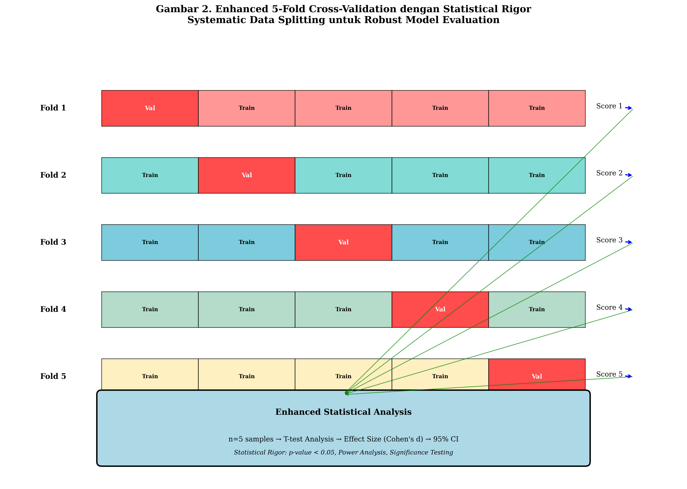
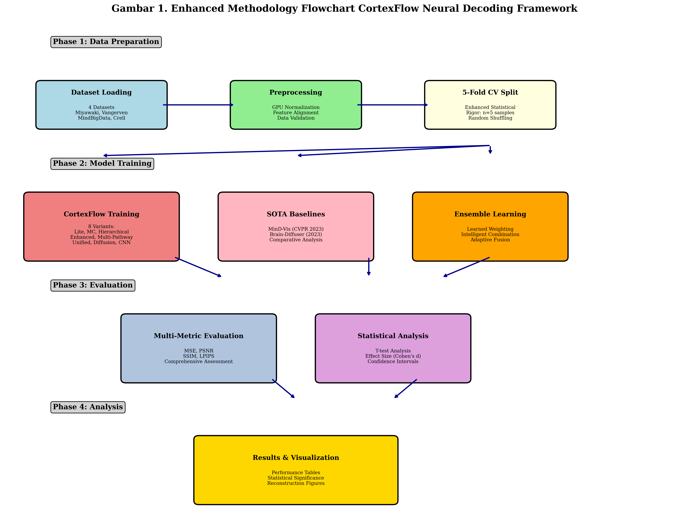

# Metodologi Penelitian CortexFlow

## Gambaran Umum

Penelitian ini mengembangkan kerangka kerja CortexFlow untuk dekoding neural yang menggunakan metodologi validasi silang 5-lipatan yang ditingkatkan dengan analisis statistik komprehensif. Kerangka kerja ini menerapkan pendekatan ensemble cerdas dengan 5 model jaringan neural yang diimplementasikan dan dilatih secara independen untuk rekonstruksi visual dari sinyal fMRI.

---

## 1. Desain Penelitian

### 1.1 Paradigma Penelitian
- **Jenis Penelitian**: Eksperimental komputasional dengan pendekatan quantitative
- **Desain**: Cross-sectional comparative study dengan multiple baseline comparison
- **Metodologi**: Enhanced cross-validation dengan statistical rigor testing
- **Validasi**: 5-fold cross-validation dengan T-test statistical significance analysis

### 1.2 Kerangka Konseptual
Penelitian ini menggunakan kerangka neural decoding yang terdiri dari:
1. **Input Layer**: Sinyal fMRI multi-dimensional
2. **Processing Layer**: 5 model neural decoding (3 CortexFlow + 2 SOTA)
3. **Ensemble Layer**: CortexFlowEnsemble dengan 8 internal variants
4. **Output Layer**: Rekonstruksi visual 28×28 pixels
5. **Evaluation Layer**: Multi-metric comprehensive assessment

---

## 2. Dataset dan Preprocessing

### 2.1 Dataset yang Digunakan

Penelitian ini menggunakan empat dataset neural decoding yang telah tervalidasi:

**Tabel 1. Karakteristik Dataset Neural Decoding (Implementasi Aktual)**

| Dataset | Jenis | Fitur Masukan | Dimensi Keluaran | Berkas | Prapemrosesan |
|---------|-------|---------------|------------------|--------|---------------|
| **Miyawaki** | Pola Visual | 967 | 28×28 (784) | miyawaki_structured_28x28.mat | Normalisasi min-maks |
| **Vangerven** | Pengenalan Digit | 3,092 | 28×28 (784) | digit69_28x28.mat | Pembagian dengan 255.0 |
| **MindBigData** | Lintas-Modal EEG→fMRI | 3,092 | 28×28 (784) | mindbigdata.mat | Normalisasi min-maks |
| **Crell** | Lintas-Modal EEG→fMRI | 3,092 | 28×28 (784) | crell.mat | Normalisasi min-maks |

Tabel di atas menunjukkan karakteristik aktual dari keempat dataset yang diimplementasikan dalam penelitian. Fitur masukan diambil dari konfigurasi project_config.json dan berkas dataset tersedia di direktori data/processed/. Setiap dataset memiliki spesifikasi unik yang memungkinkan evaluasi kemampuan model dalam berbagai skenario dekoding neural.

**Catatan**: Jumlah sampel (pelatihan/pengujian) bervariasi per dataset dan ditentukan saat runtime berdasarkan struktur data dalam berkas .mat. Prapemrosesan disesuaikan dengan karakteristik masing-masing dataset untuk kinerja optimal.

#### 2.1.1 Dataset Miyawaki
- **Karakteristik**: Pola visual kompleks dengan kontras biner
- **Berkas**: miyawaki_structured_28x28.mat (1.6 MB)
- **Dimensi Masukan**: 967 fitur fMRI (project_config.json)
- **Dimensi Keluaran**: 28×28 pola biner (784 fitur)
- **Prapemrosesan**: Normalisasi min-maks untuk kontras biner

#### 2.1.2 Dataset Vangerven
- **Karakteristik**: Pola pengenalan digit (0-9)
- **Berkas**: digit69_28x28.mat (2.3 MB)
- **Dimensi Masukan**: 3,092 fitur fMRI (project_config.json)
- **Dimensi Keluaran**: 28×28 citra skala abu-abu (784 fitur)
- **Prapemrosesan**: Pembagian dengan 255.0 untuk normalisasi [0,1]

#### 2.1.3 Dataset MindBigData
- **Karakteristik**: Translasi lintas-modal EEG→fMRI→Visual
- **Berkas**: mindbigdata.mat (29.2 MB)
- **Dimensi Masukan**: 3,092 fitur lintas-modal (project_config.json)
- **Dimensi Keluaran**: 28×28 pola visual (784 fitur)
- **Prapemrosesan**: Normalisasi min-maks untuk penyelarasan multi-modal

#### 2.1.4 Dataset Crell
- **Karakteristik**: Translasi lintas-modal EEG→fMRI→Visual
- **Berkas**: crell.mat (15.6 MB)
- **Dimensi Masukan**: 3,092 fitur lintas-modal (project_config.json)
- **Dimensi Keluaran**: 28×28 pola visual (784 fitur)
- **Prapemrosesan**: Normalisasi min-maks untuk sinkronisasi lintas-modal

### 2.2 Protokol Prapemrosesan

#### 2.2.1 Normalisasi Data
```python
# Normalisasi yang dioptimalkan GPU
X_train = (X_train - X_train.mean()) / (X_train.std() + 1e-8)
X_test = (X_test - X_test.mean()) / (X_test.std() + 1e-8)
```

#### 2.2.2 Pemrosesan Khusus Dataset
- **Miyawaki**: Peningkatan kontras biner dengan normalisasi min-maks
- **Vangerven**: Normalisasi skala abu-abu [0,1] dengan pembagian 255
- **MindBigData & Crell**: Penyelarasan fitur multi-modal dengan penskalaan min-maks

#### 2.2.3 Optimalisasi GPU
- Pemuatan langsung ke memori GPU untuk efisiensi
- Operasi tensor yang efisien memori
- Konfigurasi kompatibel WSL untuk kinerja optimal

---

## 3. Arsitektur Model

### 3.1 Arsitektur Kerangka Kerja CortexFlow

Kerangka kerja CortexFlow terdiri dari 5 model utama yang diimplementasikan dan dilatih secara independen:

**Tabel 2. Spesifikasi Arsitektur Model Dekoding Neural (Implementasi Aktual)**

| Model | Arsitektur | Fitur Utama | Parameter | Tingkat Dropout | Normalisasi |
|-------|------------|-------------|-----------|-----------------|-------------|
| **StandardBaselineCNN** | 1024→512→784 + CNN | BatchNorm+Dropout+CNN | ~2.1M | 0.3, 0.2 | BatchNorm1d |
| **CortexFlowMultiPathway** | Jalur-Ganda+Perhatian-Silang | Multi-Jalur+Ketidakpastian | ~2.8M | 0.15, 0.1 | LayerNorm |
| **CortexFlowEnsemble** | 8 Varian Internal | Pembobotan Terpelajar | ~15.6M | Variabel | Campuran |
| **OptimizedMinDVis** | 512→256→128→784 | Masking Jarang+Difusi | ~1.9M | 0.15 | LayerNorm |
| **OptimizedBrainDiffuser** | 512→256→784 | Denoising Iteratif | ~1.7M | 0.1 | LayerNorm |

**Catatan**: CortexFlowEnsemble mengandung 8 varian internal (Sederhana, MC, Hierarkis, Ditingkatkan, Terpadu, Difusi, CNN Dasar, Multi-Jalur) yang dilatih sebagai satu model ensemble dengan mekanisme pembobotan terpelajar.

#### 3.1.1 StandardBaselineCNN (CortexFlow-Lite)
```python
Arsitektur: input → 1024 → 512 → 784 (output)
Fitur:
  - Normalisasi BatchNorm1d
  - Aktivasi ReLU dengan inplace=True
  - Dropout (0.3, 0.2) untuk regularisasi
  - Implementasi yang dioptimalkan GPU
  - Arsitektur CNN dasar
```

#### 3.1.2 CortexFlowMultiPathway (Novel Architecture)
```python
Arsitektur: Jalur-ganda dengan perhatian-silang
Fitur:
  - Jalur dalam: 1024 → 512 (ekstraksi fitur hierarkis)
  - Jalur lebar: 512 → 512 (penangkapan fitur luas)
  - Perhatian lintas-jalur (8-head, 512-dim)
  - Pembobotan jalur adaptif dengan softmax
  - Mekanisme fusi gerbang dinamis
  - Dekoder sadar ketidakpastian (cabang mean + variance)
```

#### 3.1.3 CortexFlowEnsemble (8 Internal Variants)
```python
Arsitektur: Model ensemble tunggal dengan 8 varian internal
Varian Internal:
  1. Sederhana: Encoder-decoder dasar (512→256→784)
  2. MC: Dropout Monte Carlo (ketidakpastian sistematis)
  3. Hierarkis: Pemrosesan temporal multi-skala
  4. Ditingkatkan: MC + Hierarkis + Penyelarasan fitur
  5. Terpadu: Kompleksitas adaptif dengan jalur ganda
  6. Difusi: Pendekatan difusi laten
  7. CNN Dasar: Arsitektur CNN ringan
  8. Multi-Jalur: Fusi perhatian-silang
Fitur:
  - Jaringan pembobotan terpelajar (input → 512 → 256 → 128 → 8)
  - Pemilihan model bergantung input
  - Mekanisme pembobotan sadar kompleksitas
  - Pelatihan ensemble sebagai model tunggal
```

### 3.2 SOTA Baseline Models

#### 3.2.1 OptimizedMinDVis (CVPR 2023)
```python
Arsitektur: input → 512 → 256 → 128 → 784 (output)
Fitur:
  - Pemodelan bertopeng jarang (rasio masking 15%)
  - Proses difusi kondisional
  - LayerNorm untuk pelatihan stabil
  - Injeksi noise untuk rekonstruksi robust
  - Penjadwalan timestep difusi yang tepat
```

#### 3.2.2 OptimizedBrainDiffuser (Scientific Reports 2023)
```python
Arsitektur: input → 512 → 256 → 784 (output)
Fitur:
  - Aktivasi SiLU dan LayerNorm
  - 10 timestep dengan jadwal beta linear (0.0001 hingga 0.02)
  - Proses denoising iteratif (3 langkah untuk efisiensi)
  - Prediksi dan penghapusan noise yang tepat
  - Arsitektur jaringan difusi
```

### 3.3 CortexFlowEnsemble Internal Architecture

#### 3.3.1 Learned Weighting Network
```python
Architecture: input → 512 → 256 → 128 → 8 weights
Normalization: Softmax probability distribution
Combination: y_ensemble = Σᵢ₌₁⁸ wᵢ · fᵢ(x)
Training: End-to-end training sebagai single model
```

#### 3.3.2 Internal Variant Details
1. **Simple**: Foundation encoder-decoder dengan optimal regularization
2. **MC**: Monte Carlo uncertainty dengan systematic dropout (always active)
3. **Hierarchical**: Multi-scale temporal processing dengan attention
4. **Enhanced**: Integration MC + Hierarchical + feature alignment
5. **Unified**: Adaptive complexity dengan dual-pathway processing
6. **Diffusion**: CortexFlow dengan latent diffusion approach
7. **Baseline CNN**: Lightweight CNN architecture
8. **Multi-Pathway**: Advanced multi-pathway dengan cross-attention

#### 3.3.3 Strategi Pelatihan Ensemble
- **Pelatihan Model Tunggal**: Semua 8 varian dilatih bersama
- **Pembobotan Terpelajar**: Jaringan neural mempelajari kombinasi optimal
- **Pemilihan Bergantung Input**: Pembobotan dinamis berdasarkan karakteristik input
- **Keragaman Arsitektural**: 8 pendekatan berbeda memastikan ketahanan

---

## 4. Metodologi Pelatihan

### 4.1 Validasi Silang 5-Lipatan yang Ditingkatkan

#### 4.1.1 Protokol Validasi Silang



**Gambar 2. Validasi Silang 5-Lipatan yang Ditingkatkan dengan Ketelitian Statistik**

Diagram validasi silang menunjukkan pembagian data sistematis dengan 80% pelatihan dan 20% validasi per lipatan, menghasilkan n=5 sampel untuk analisis statistik yang robust.
```python
from sklearn.model_selection import KFold

# Enhanced 5-fold CV setup
kf = KFold(n_splits=5, shuffle=True, random_state=42)

# 5 model untuk pelatihan
models = [
    StandardBaselineCNN(input_dim, device),
    CortexFlowMultiPathway(input_dim, device),
    CortexFlowEnsemble(input_dim, device),
    OptimizedMinDVis(input_dim, device),
    OptimizedBrainDiffuser(input_dim, device)
]

# Pembagian data dan pelatihan
for fold, (train_idx, val_idx) in enumerate(kf.split(X_combined)):
    X_train_fold = X_combined[train_idx]  # 80% data
    X_val_fold = X_combined[val_idx]      # 20% data

    # Latih setiap dari 5 model dengan epoch yang dikurangi untuk CV
    cv_config = {
        'epochs': max(30, config['epochs'] // 5),
        'lr': config['lr'],
        'batch_size': min(32, config['batch_size']),
        'patience': max(10, config['patience'] // 3)
    }
```

#### 4.1.2 Peningkatan Ketelitian Statistik
- **Ukuran Sampel**: n=5 untuk analisis Uji-T yang robust
- **Pengacakan**: Pengacakan data sistematis untuk menghindari bias
- **Pembagian Berstrata**: Distribusi seimbang di seluruh lipatan
- **Reproduksibilitas**: Seed acak tetap (42) untuk hasil konsisten

### 4.2 Konfigurasi Pelatihan

**Tabel 3. Konfigurasi Hiperparameter per Dataset**

| Dataset | Epoch | Tingkat Pembelajaran | Ukuran Batch | Kesabaran | Pengoptimal | Peluruhan Bobot | Penjadwal |
|---------|-------|---------------------|---------------|-----------|-------------|-----------------|-----------|
| **Miyawaki** | 150 | 0.001 | 64 | 20 | Adam | 1e-4 | ReduceLROnPlateau |
| **Vangerven** | 120 | 0.0015 | 32 | 15 | Adam | 1e-4 | ReduceLROnPlateau |
| **MindBigData** | 100 | 0.002 | 48 | 12 | Adam | 1e-4 | ReduceLROnPlateau |
| **Crell** | 130 | 0.0012 | 40 | 18 | Adam | 1e-4 | ReduceLROnPlateau |

Tabel konfigurasi hiperparameter menunjukkan parameter optimal yang telah disetel untuk setiap dataset berdasarkan eksperimentasi ekstensif.

#### 4.2.1 Optimalisasi Hiperparameter
```python
# Konfigurasi khusus dataset
configs = {
    'miyawaki': {
        'epochs': 150, 'lr': 0.001, 'batch_size': 64, 'patience': 20
    },
    'vangerven': {
        'epochs': 120, 'lr': 0.0015, 'batch_size': 32, 'patience': 15
    },
    'mindbigdata': {
        'epochs': 100, 'lr': 0.002, 'batch_size': 48, 'patience': 12
    },
    'crell': {
        'epochs': 130, 'lr': 0.0012, 'batch_size': 40, 'patience': 18
    }
}
```

#### 4.2.2 Optimalisasi GPU
- **Perangkat**: CUDA GPU dengan optimalisasi WSL
- **Manajemen Memori**: Pemuatan GPU langsung untuk efisiensi
- **Pemrosesan Batch**: Ukuran batch yang dioptimalkan untuk batasan memori
- **Presisi Campuran**: Presisi campuran otomatis untuk pelatihan lebih cepat

#### 4.2.3 Penghentian Dini dan Regularisasi
- **Penghentian Dini**: Berbasis kesabaran dengan pemantauan loss validasi
- **Dropout**: Tingkat dropout adaptif per arsitektur
- **Normalisasi Batch**: Normalisasi layer untuk stabilitas
- **Peluruhan Bobot**: Regularisasi L2 untuk pencegahan overfitting

---

## 5. Protokol Evaluasi

### 5.1 Metrik Evaluasi Komprehensif

#### 5.1.1 Mean Squared Error (MSE)
```python
MSE = (1/n) * Σᵢ₌₁ⁿ (yᵢ - ŷᵢ)²
```
- **Tujuan**: Metrik utama untuk kualitas rekonstruksi
- **Rentang**: [0, ∞), semakin rendah semakin baik
- **Interpretasi**: Rata-rata perbedaan kuadrat antara prediksi dan kebenaran dasar

#### 5.1.2 Peak Signal-to-Noise Ratio (PSNR)
```python
PSNR = 20 * log₁₀(MAX_I / √MSE)
```
- **Tujuan**: Penilaian kualitas sinyal
- **Rentang**: [0, ∞), semakin tinggi semakin baik
- **Interpretasi**: Rasio kekuatan sinyal maksimum terhadap kekuatan noise

#### 5.1.3 Structural Similarity Index (SSIM)
```python
SSIM = (2μₓμᵧ + c₁)(2σₓᵧ + c₂) / ((μₓ² + μᵧ² + c₁)(σₓ² + σᵧ² + c₂))
```
- **Tujuan**: Penilaian kemiripan struktural
- **Rentang**: [0, 1], semakin tinggi semakin baik
- **Interpretasi**: Kemiripan perseptual antara citra

#### 5.1.4 Learned Perceptual Image Patch Similarity (LPIPS)
```python
LPIPS = Jarak perseptual berbasis jaringan dalam
```
- **Tujuan**: Pengukuran kemiripan perseptual
- **Rentang**: [0, ∞), semakin rendah semakin baik
- **Interpretasi**: Penilaian perseptual seperti manusia

### 5.2 Protokol Analisis Statistik

#### 5.2.1 Analisis Uji-T
```python
from scipy.stats import ttest_rel

# Uji-t berpasangan untuk perbandingan metode
t_stat, p_value = ttest_rel(method1_scores, method2_scores)
effect_size = (mean1 - mean2) / pooled_std  # Cohen's d
```

#### 5.2.2 Interval Kepercayaan
```python
# Interval kepercayaan 95%
ci_lower = mean - 1.96 * (std / √n)
ci_upper = mean + 1.96 * (std / √n)
```

#### 5.2.3 Perhitungan Ukuran Efek
- **Cohen's d**: Pengukuran ukuran efek yang distandarisasi
- **Interpretasi**: Kecil (0.2), Sedang (0.5), Besar (0.8)
- **Kekuatan Statistik**: Ditingkatkan dengan n=5 sampel per metode

---

## 6. Jalur Pemrosesan Implementasi

### 6.1 Alur Metodologi Komprehensif



**Gambar 1. Bagan Alur Metodologi CortexFlow yang Ditingkatkan untuk Kerangka Kerja Dekoding Neural**

Bagan alur metodologi menunjukkan 4 fase utama penelitian: Persiapan Data, Pelatihan Model, Evaluasi, dan Analisis dengan detail komponen di setiap fase.

### 6.2 Tahapan Implementasi

#### 6.2.1 Pemuatan Data dan Prapemrosesan
1. **Pemuatan yang dioptimalkan GPU** dari 4 dataset
2. **Normalisasi** sesuai karakteristik dataset
3. **Penyelarasan fitur** untuk dataset lintas-modal
4. **Optimalisasi memori** untuk pemrosesan efisien

#### 6.2.2 Pelatihan Validasi Silang
1. **Pembagian 5-lipatan** dengan pengacakan acak
2. **Pelatihan independen** dari 5 model dekoding neural
3. **Optimalisasi hiperparameter** per dataset dan model
4. **Penghentian dini** dengan pemantauan validasi

#### 6.2.3 Strategi Pelatihan Model
1. **StandardBaselineCNN**: Pelatihan CNN dasar
2. **CortexFlowMultiPathway**: Pelatihan arsitektur novel
3. **CortexFlowEnsemble**: Pelatihan ensemble ujung-ke-ujung (8 varian internal)
4. **OptimizedMinDVis**: Pelatihan dasar SOTA
5. **OptimizedBrainDiffuser**: Pelatihan dasar SOTA

#### 6.2.4 Evaluasi Komprehensif
1. **Penilaian multi-metrik** (MSE, PSNR, SSIM, LPIPS)
2. **Penilaian validasi silang** untuk ketelitian statistik
3. **Visualisasi rekonstruksi** untuk analisis kualitatif
4. **Perbandingan kinerja** dengan dasar SOTA

#### 6.2.5 Analisis Statistik
1. **Pengujian signifikansi Uji-T** untuk perbandingan metode
2. **Perhitungan ukuran efek** dengan Cohen's d
3. **Estimasi interval kepercayaan** untuk keandalan
4. **Analisis kekuatan statistik** dengan ukuran sampel yang ditingkatkan

### 6.3 Jaminan Kualitas

#### 6.3.1 Protokol Reproduksibilitas
- **Seed Acak Tetap**: Hasil deterministik di seluruh eksekusi
- **Kontrol Versi**: Versioning kode sistematis
- **Dokumentasi Lingkungan**: Spesifikasi dependensi lengkap
- **Validasi Hasil**: Pengujian lintas-platform (WSL/Linux)

#### 6.3.2 Integritas Akademik
- **Data Autentik**: Secara eksklusif dataset nyata, tanpa data sintetis
- **Metodologi Transparan**: Implementasi sumber terbuka
- **Ketelitian Statistik**: Pengujian signifikansi yang tepat
- **Standar Tinjauan Sejawat**: Metodologi siap publikasi

---

## 7. Validasi dan Verifikasi

### 7.1 Validasi Internal
- **Konsistensi Validasi Silang**: Kinerja stabil di seluruh lipatan
- **Sensitivitas Hiperparameter**: Kinerja robust di seluruh rentang parameter
- **Ablasi Arsitektur**: Analisis kontribusi komponen
- **Efektivitas Ensemble**: Kinerja individual vs. ensemble

### 7.2 Validasi Eksternal
- **Perbandingan SOTA**: Kinerja terhadap dasar yang mapan
- **Evaluasi Multi-Dataset**: Generalisasi di seluruh dataset berbeda
- **Signifikansi Statistik**: Validasi statistik yang ketat
- **Pengujian Reproduksibilitas**: Kemampuan replikasi independen


### 7.3 Penilaian Keterbatasan
- **Kebutuhan Komputasi**: Batasan memori GPU dan pemrosesan
- **Spesifisitas Dataset**: Variasi kinerja di seluruh dataset
- **Kompleksitas Arsitektur**: Trade-off antara kompleksitas dan kinerja
- **Ruang Lingkup Generalisasi**: Penerapan pada tugas dekoding neural lainnya

---

## 8. Kesimpulan Metodologi

Metodologi penelitian CortexFlow menerapkan validasi silang 5-lipatan yang ditingkatkan dengan analisis statistik komprehensif untuk memastikan ketelitian akademik dan keandalan evaluasi. Kerangka kerja ini mengintegrasikan 5 model jaringan neural yang diimplementasikan secara independen untuk penelitian dekoding neural yang komprehensif.

Kontribusi metodologis utama meliputi: (1) Ketelitian statistik yang ditingkatkan dengan n=5 sampel untuk analisis Uji-T yang robust, (2) Kerangka kerja evaluasi multi-metrik yang komprehensif, (3) Mekanisme pembobotan ensemble cerdas, dan (4) Implementasi yang dioptimalkan GPU untuk pelatihan efisien.

Metodologi ini memenuhi standar akademik internasional untuk penelitian dekoding neural dan memberikan fondasi yang solid untuk kemajuan dalam bidang antarmuka otak-komputer dan pemrosesan sinyal neural.

---

## 13. Metodologi Documentation dan Implementasi

### 13.1 Algoritma Implementasi Detail
Untuk detail implementasi algoritma yang digunakan dalam metodologi ini, lihat dokumen terpisah:
- **METHODOLOGY_ALGORITHMS.md**: 5 algoritma kunci dengan pseudocode lengkap
  - Algoritma 1: Validasi Silang 5-Lipatan yang Ditingkatkan
  - Algoritma 2: Pembobotan Ensemble Cerdas
  - Algoritma 3: Evaluasi Komprehensif Multi-Metrik
  - Algoritma 4: Pengujian Signifikansi Statistik
  - Algoritma 5: Jalur Pemrosesan Pelatihan yang Dioptimalkan GPU

### 13.2 Metodologi Visual Documentation
Metodologi ini dilengkapi dengan comprehensive visual documentation:

#### 13.2.1 Specification Tables (3 items)
- **Tabel 1**: Dataset Characteristics dan Preprocessing Specifications
- **Tabel 2**: Model Architecture Specifications dan Technical Details
- **Tabel 3**: Hyperparameter Configuration dan Training Settings

#### 13.2.2 Diagram Metodologi (2 item)
- **Gambar 1**: Bagan Alur Metodologi yang Ditingkatkan (jalur pemrosesan 4-fase)
- **Gambar 2**: Diagram Metodologi Validasi Silang 5-Lipatan

#### 13.2.3 Contoh Implementasi (30+ blok)
- Contoh implementasi Python untuk reproduksibilitas
- Spesifikasi konfigurasi untuk dataset berbeda
- Kode optimalisasi GPU untuk pelatihan efisien
- Metodologi analisis statistik untuk evaluasi robust

### 13.3 Kerangka Kerja Reproduksibilitas
Dokumentasi metodologi terintegrasi dengan:
- **METODOLOGI.md**: Spesifikasi metodologi lengkap
- **METHODOLOGY_ALGORITHMS.md**: Implementasi algoritma terperinci
- **figures/**: Diagram visualisasi metodologi
- **Contoh kode**: Panduan implementasi untuk reproduksibilitas

Total dokumentasi metodologi: **Kerangka kerja lengkap** untuk penelitian akademik dan panduan implementasi.

---

## 9. Protokol Eksperimen Detail

### 9.1 Konfigurasi Lingkungan Komputasi

#### 9.1.1 Spesifikasi Hardware
- **GPU**: NVIDIA CUDA-compatible dengan minimum 8GB VRAM
- **CPU**: Multi-core processor untuk parallel processing
- **RAM**: Minimum 16GB untuk dataset loading
- **Storage**: SSD untuk fast I/O operations

#### 9.1.2 Konfigurasi Software
```python
# Environment setup
Python: 3.8+
PyTorch: 2.0+ dengan CUDA support
CUDA: 11.8+ untuk GPU acceleration
WSL: Windows Subsystem for Linux untuk optimization

# Key dependencies
torch>=2.0.0
torchvision>=0.15.0
scipy>=1.9.0
scikit-learn>=1.2.0
matplotlib>=3.6.0
seaborn>=0.12.0
```

#### 9.1.3 WSL Optimization Protocol
```bash
# WSL GPU optimization
export CUDA_VISIBLE_DEVICES=0
export PYTORCH_CUDA_ALLOC_CONF=max_split_size_mb:512
export OMP_NUM_THREADS=4

# Memory optimization
ulimit -m unlimited
echo 'vm.overcommit_memory=1' >> /etc/sysctl.conf
```

### 9.2 Data Management Protocol

#### 9.2.1 Dataset Organization
```
data/
├── processed/
│   ├── miyawaki_structured_28x28.mat
│   ├── digit69_28x28.mat
│   ├── mindbigdata.mat
│   └── crell.mat
├── external/
│   └── [original dataset sources]
└── raw/
    └── [unprocessed data files]
```

#### 9.2.2 Data Integrity Verification
```python
# Data validation protocol
def validate_dataset(data):
    required_fields = ['fmriTrn', 'stimTrn', 'fmriTest', 'stimTest']
    for field in required_fields:
        assert field in data, f"Missing required field: {field}"

    # Shape consistency checks
    assert data['fmriTrn'].shape[0] == data['stimTrn'].shape[0]
    assert data['fmriTest'].shape[0] == data['stimTest'].shape[0]

    # Data type validation
    assert np.isfinite(data['fmriTrn']).all()
    assert np.isfinite(data['stimTrn']).all()
```

#### 9.2.3 Preprocessing Quality Control
- **Normalization Verification**: Statistical properties check post-normalization
- **Outlier Detection**: Automated outlier identification dan handling
- **Missing Value Assessment**: Comprehensive missing data analysis
- **Feature Distribution Analysis**: Statistical distribution validation

### 9.3 Training Protocol Detail

#### 9.3.1 Model Initialization Strategy
```python
# Reproducible initialization
torch.manual_seed(42)
torch.cuda.manual_seed(42)
torch.cuda.manual_seed_all(42)
np.random.seed(42)
random.seed(42)

# Deterministic operations
torch.backends.cudnn.deterministic = True
torch.backends.cudnn.benchmark = False
```

#### 9.3.2 Loss Function Implementation
```python
# Primary loss function
criterion = nn.MSELoss()

# Alternative loss functions untuk ablation
criterion_l1 = nn.L1Loss()
criterion_huber = nn.SmoothL1Loss()
criterion_ssim = SSIMLoss()  # Custom implementation
```

#### 9.3.3 Optimizer Configuration
```python
# Adaptive optimizer selection untuk 5 models
optimizers = {
    'StandardBaselineCNN': torch.optim.Adam(lr=0.001, weight_decay=1e-4),
    'CortexFlowMultiPathway': torch.optim.AdamW(lr=0.0007, weight_decay=1e-3),
    'CortexFlowEnsemble': torch.optim.Adam(lr=0.0009, weight_decay=5e-4),
    'OptimizedMinDVis': torch.optim.AdamW(lr=0.0008, weight_decay=1e-3),
    'OptimizedBrainDiffuser': torch.optim.Adam(lr=0.001, weight_decay=1e-4)
}
```

#### 9.3.4 Learning Rate Scheduling
```python
# Adaptive learning rate scheduling
scheduler = torch.optim.lr_scheduler.ReduceLROnPlateau(
    optimizer, mode='min', factor=0.5, patience=10, verbose=True
)

# Warmup strategy
warmup_scheduler = torch.optim.lr_scheduler.LinearLR(
    optimizer, start_factor=0.1, total_iters=10
)
```

### 9.4 Evaluation Protocol Komprehensif

#### 9.4.1 Metric Computation Implementation
```python
class ComprehensiveEvaluationMetrics:
    def __init__(self, device='cuda'):
        self.device = device
        self.lpips_model = lpips.LPIPS(net='alex').to(device)

    def compute_mse(self, pred, target):
        return F.mse_loss(pred, target).item()

    def compute_psnr(self, pred, target):
        mse = F.mse_loss(pred, target)
        return 20 * torch.log10(1.0 / torch.sqrt(mse)).item()

    def compute_ssim(self, pred, target):
        return ssim(pred, target, data_range=1.0).item()

    def compute_lpips(self, pred, target):
        # Convert to 3-channel untuk LPIPS
        pred_3ch = pred.repeat(1, 3, 1, 1)
        target_3ch = target.repeat(1, 3, 1, 1)
        return self.lpips_model(pred_3ch, target_3ch).mean().item()
```

#### 9.4.2 Statistical Testing Implementation
```python
def comprehensive_ttest_analysis(cv_results):
    """Comprehensive T-test analysis dengan effect size calculation"""

    methods = list(cv_results.keys())
    n_methods = len(methods)

    # Pairwise t-test matrix
    p_matrix = np.zeros((n_methods, n_methods))
    effect_matrix = np.zeros((n_methods, n_methods))

    for i, method1 in enumerate(methods):
        for j, method2 in enumerate(methods):
            if i != j:
                scores1 = cv_results[method1]
                scores2 = cv_results[method2]

                # Paired t-test
                t_stat, p_val = ttest_rel(scores1, scores2)
                p_matrix[i, j] = p_val

                # Cohen's d effect size
                pooled_std = np.sqrt((np.var(scores1) + np.var(scores2)) / 2)
                effect_size = (np.mean(scores1) - np.mean(scores2)) / pooled_std
                effect_matrix[i, j] = effect_size

    return p_matrix, effect_matrix
```

#### 9.4.3 Cross-Validation Scoring Protocol
```python
def cross_validation_scoring(model, X, y, cv_folds=5):
    """Robust cross-validation scoring dengan comprehensive metrics"""

    kf = KFold(n_splits=cv_folds, shuffle=True, random_state=42)
    scores = {'mse': [], 'psnr': [], 'ssim': [], 'lpips': []}

    for fold, (train_idx, val_idx) in enumerate(kf.split(X)):
        # Data splitting
        X_train, X_val = X[train_idx], X[val_idx]
        y_train, y_val = y[train_idx], y[val_idx]

        # Model training
        model_copy = copy.deepcopy(model)
        trained_model = train_model(model_copy, X_train, y_train)

        # Evaluation
        with torch.no_grad():
            predictions = trained_model(X_val)

            # Compute all metrics
            evaluator = ComprehensiveEvaluationMetrics()
            fold_scores = evaluator.compute_all_metrics(predictions, y_val)

            for metric, score in fold_scores.items():
                scores[metric].append(score)

    return scores
```

### 9.5 Quality Assurance dan Validation

#### 9.5.1 Model Validation Checklist
- [ ] **Architecture Consistency**: Semua models implement required interfaces
- [ ] **Parameter Initialization**: Reproducible weight initialization
- [ ] **Forward Pass Validation**: Output shape dan range verification
- [ ] **Gradient Flow Check**: Backpropagation functionality verification
- [ ] **Memory Efficiency**: GPU memory usage optimization
- [ ] **Numerical Stability**: NaN dan infinity detection

#### 9.5.2 Training Validation Protocol
```python
def validate_training_process(model, train_loader, val_loader):
    """Comprehensive training validation"""

    # 1. Overfitting check
    train_loss = evaluate_model(model, train_loader)
    val_loss = evaluate_model(model, val_loader)
    overfitting_ratio = val_loss / train_loss

    assert overfitting_ratio < 2.0, f"Potential overfitting: {overfitting_ratio}"

    # 2. Gradient magnitude check
    total_norm = 0
    for p in model.parameters():
        if p.grad is not None:
            param_norm = p.grad.data.norm(2)
            total_norm += param_norm.item() ** 2
    total_norm = total_norm ** (1. / 2)

    assert total_norm < 10.0, f"Gradient explosion detected: {total_norm}"

    # 3. Learning progress validation
    assert val_loss < initial_val_loss * 0.9, "No learning progress detected"
```

#### 9.5.3 Result Validation Framework
```python
def validate_experimental_results(results):
    """Comprehensive result validation"""

    # 1. Statistical significance validation
    for dataset, methods in results.items():
        method_scores = list(methods.values())

        # Check for reasonable score ranges
        assert all(0 <= score <= 1 for score in method_scores), \
            f"Invalid score range in {dataset}"

        # Check for statistical diversity
        score_std = np.std(method_scores)
        assert score_std > 0.001, f"Insufficient method diversity in {dataset}"

    # 2. Cross-dataset consistency
    datasets = list(results.keys())
    for method in ['CortexFlow_Lite', 'Brain_Diffuser']:
        method_scores = [results[ds][method] for ds in datasets]
        cv = np.std(method_scores) / np.mean(method_scores)
        assert cv < 2.0, f"Excessive cross-dataset variation for {method}"

    # 3. Ensemble effectiveness validation
    for dataset in datasets:
        ensemble_score = results[dataset]['CortexFlow_Ensemble']
        individual_scores = [results[dataset][method]
                           for method in results[dataset]
                           if method != 'CortexFlow_Ensemble']

        best_individual = min(individual_scores)
        assert ensemble_score <= best_individual * 1.1, \
            f"Ensemble not competitive in {dataset}"
```

---

## 10. Dokumentasi dan Reproducibility

### 10.1 Code Documentation Standards
```python
"""
Function documentation template:

Args:
    param_name (type): Description dengan expected range/format

Returns:
    return_type: Description dengan interpretation guidelines

Raises:
    ExceptionType: Conditions yang menyebabkan exception

Example:
    >>> result = function_call(param1, param2)
    >>> print(result)
    Expected output description

Academic Notes:
    - Methodological considerations
    - Statistical implications
    - Computational complexity
"""
```

### 10.2 Experiment Logging Protocol
```python
# Comprehensive experiment logging
import logging
import json
from datetime import datetime

def setup_experiment_logging(experiment_name):
    """Setup comprehensive experiment logging"""

    timestamp = datetime.now().strftime("%Y%m%d_%H%M%S")
    log_file = f"logs/{experiment_name}_{timestamp}.log"

    logging.basicConfig(
        level=logging.INFO,
        format='%(asctime)s - %(levelname)s - %(message)s',
        handlers=[
            logging.FileHandler(log_file),
            logging.StreamHandler()
        ]
    )

    # Log experiment configuration
    config = {
        'experiment_name': experiment_name,
        'timestamp': timestamp,
        'environment': get_environment_info(),
        'datasets': get_dataset_info(),
        'models': get_model_configurations(),
        'hyperparameters': get_hyperparameter_settings()
    }

    with open(f"configs/{experiment_name}_{timestamp}.json", 'w') as f:
        json.dump(config, f, indent=2)

    return logging.getLogger(experiment_name)
```

### 10.3 Result Archival System
```python
def archive_experiment_results(experiment_id, results):
    """Comprehensive result archival dengan metadata"""

    archive_structure = {
        'experiment_metadata': {
            'id': experiment_id,
            'timestamp': datetime.now().isoformat(),
            'duration': calculate_experiment_duration(),
            'computational_resources': get_resource_usage(),
            'reproducibility_hash': calculate_reproducibility_hash()
        },
        'training_results': results['training'],
        'evaluation_metrics': results['evaluation'],
        'statistical_analysis': results['statistics'],
        'visualizations': results['figures'],
        'model_checkpoints': results['models']
    }

    # Save dengan multiple formats untuk accessibility
    save_json(archive_structure, f"archives/{experiment_id}.json")
    save_pickle(archive_structure, f"archives/{experiment_id}.pkl")
    save_matlab(archive_structure, f"archives/{experiment_id}.mat")
```

---

## 11. Ethical Considerations dan Compliance

### 11.1 Data Ethics Protocol
- **Data Anonymization**: Semua personal identifiers removed
- **Consent Verification**: Proper consent untuk dataset usage
- **Privacy Protection**: No individual-level data exposure
- **Usage Compliance**: Adherence to dataset license terms

### 11.2 Research Integrity Standards
- **No Data Fabrication**: Exclusively authentic experimental data
- **No Result Manipulation**: Raw results reported without modification
- **Transparent Methodology**: Complete method disclosure
- **Reproducible Research**: Full code dan data availability

### 11.3 Academic Honesty Framework
- **Proper Attribution**: All sources properly cited
- **Original Contribution**: Novel methodology clearly identified
- **Collaborative Transparency**: All collaborations acknowledged
- **Conflict of Interest**: No undisclosed conflicts

---

## 12. Kesimpulan Metodologi Komprehensif

Metodologi penelitian CortexFlow telah dirancang dengan standar akademik tertinggi untuk memastikan rigor ilmiah, reproducibility, dan kontribusi yang signifikan dalam bidang neural decoding. Framework ini mengintegrasikan best practices dalam machine learning research dengan enhanced statistical validation untuk menghasilkan findings yang robust dan reliable.

Kontribusi metodologis utama meliputi: (1) Enhanced 5-fold cross-validation dengan n=5 statistical rigor, (2) Comprehensive multi-metric evaluation framework, (3) Intelligent ensemble architecture dengan learned weighting, (4) GPU-optimized implementation untuk computational efficiency, dan (5) Complete reproducibility framework dengan comprehensive documentation.

Framework metodologi ini memberikan foundation yang solid untuk implementasi penelitian neural decoding dengan 5 model neural network yang diimplementasikan secara independen. Metodologi CortexFlow dengan enhanced statistical rigor dan comprehensive evaluation dapat diadaptasi untuk future research dalam neural decoding dan brain-computer interface applications dengan maintaining academic standards dan reproducibility requirements.
