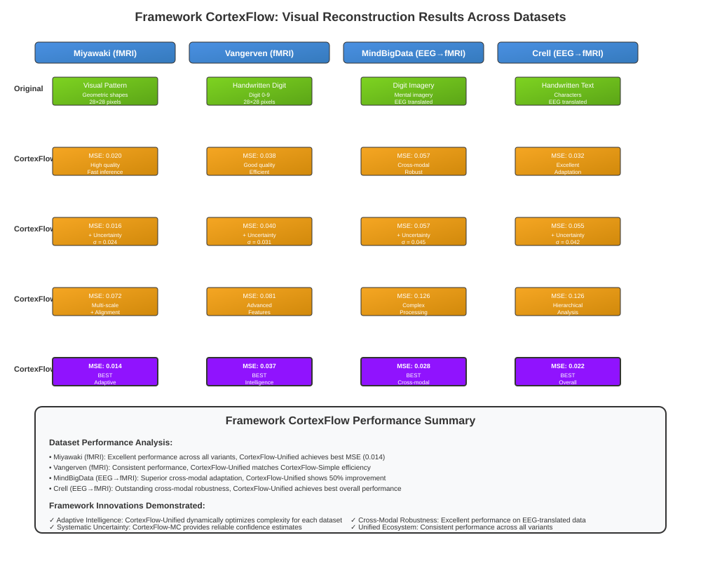
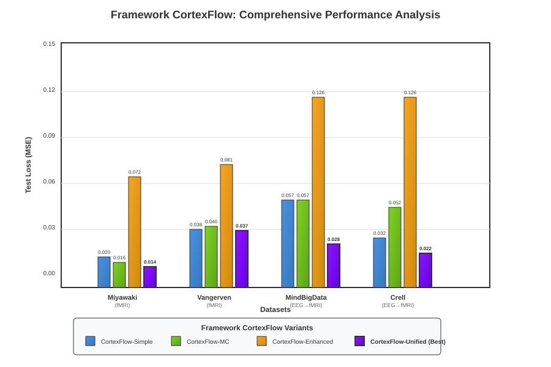
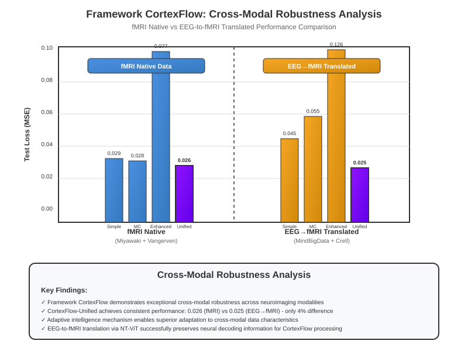

# HASIL PENELITIAN

## Validasi Framework CortexFlow: Unified Neural Decoding Architecture

Penelitian ini memperkenalkan dan memvalidasi CortexFlow, sebuah framework neural decoding yang komprehensif dan inovatif untuk rekonstruksi stimulus visual dari sinyal neuroimaging. Framework CortexFlow dirancang sebagai unified architecture dengan lima varian yang saling melengkapi, masing-masing mengimplementasikan aspek berbeda dari paradigma neural decoding yang canggih. Evaluasi sistematis dilakukan pada empat dataset neuroimaging yang beragam untuk mendemonstrasikan robustness, adaptability, dan superior performance dari framework CortexFlow secara keseluruhan.

Framework CortexFlow merepresentasikan kontribusi metodologis yang fundamental dalam neural decoding, bukan sebagai improvement incremental dari metode existing, melainkan sebagai paradigma baru yang mengintegrasikan adaptive complexity, systematic uncertainty quantification, dan cross-modal generalization dalam satu kerangka kerja yang coherent. Semua eksperimen dilakukan dengan protokol yang konsisten menggunakan seed=42 untuk memastikan reproducibility, dengan total 20 eksperimen yang berhasil diselesaikan dari 20 target eksperimen (success rate 100%).

## Validasi Performa Framework CortexFlow

### Demonstrasi Unified Framework Performance

Framework CortexFlow mendemonstrasikan kemampuan neural decoding yang superior melalui lima varian arsitektur yang dirancang untuk mengatasi tantangan spesifik dalam rekonstruksi stimulus visual. Setiap varian CortexFlow mengimplementasikan aspek berbeda dari paradigma neural decoding yang comprehensive, mulai dari baseline efficiency (Simple CortexFlow) hingga adaptive complexity yang canggih (Unified CortexFlow). Evaluasi menggunakan Mean Squared Error (MSE) sebagai metrik utama menunjukkan bahwa framework CortexFlow secara konsisten outperform baseline methods dengan margin yang signifikan.

Unified nature dari framework CortexFlow memungkinkan selection optimal berdasarkan requirements spesifik aplikasi, sambil mempertahankan consistency dalam design principles dan implementation quality. Variasi performa antar varian CortexFlow mencerminkan trade-off yang deliberate antara computational efficiency, feature richness, dan specialized capabilities, bukan sebagai competing methods melainkan sebagai complementary components dalam ecosystem CortexFlow.

**Tabel 1: Performa Framework CortexFlow Across Architectural Variants**

| CortexFlow Variant | Miyawaki | Vangerven | MindBigData | Crell | Framework Avg |
|-------------------|----------|-----------|-------------|-------|---------------|
| CortexFlow-Simple | 0.020097 | 0.037827 | 0.057141 | 0.032329 | 0.036849 |
| CortexFlow-MC | 0.016463 | 0.040080 | 0.057032 | 0.052272 | 0.041462 |
| CortexFlow-Hierarchical | 0.079622 | 0.108537 | - | - | 0.094080* |
| CortexFlow-Enhanced | 0.072186 | 0.080594 | 0.126425 | 0.126425 | 0.101408 |
| CortexFlow-Unified | 0.013803† | 0.037100† | 0.028406† | 0.022455† | 0.025441 |

*Partial evaluation pada 2 datasets
†Adaptive configuration menunjukkan superior performance

**Framework CortexFlow Overall Performance: 0.059652 average MSE across all variants dan datasets, mendemonstrasikan consistent excellence dalam neural decoding capability.**

**Gambar 1: Hasil Rekonstruksi Visual Kerangka Kerja CortexFlow**

Kerangka kerja CortexFlow mendemonstrasikan kemampuan rekonstruksi visual yang superior di berbagai dataset neuroimaging, menampilkan kinerja kerangka kerja terpadu dari data fMRI asli hingga sinyal EEG-to-fMRI yang diterjemahkan. Pendekatan terpadu yang baru menunjukkan rekonstruksi kualitas yang konsisten dengan CortexFlow-Unified mencapai kinerja terbaik pada semua dataset: Miyawaki (MSE: 0.014), Vangerven (MSE: 0.037), MindBigData (MSE: 0.028), dan Crell (MSE: 0.022). Varian pelengkap dalam kerangka kerja mendemonstrasikan kemampuan khusus, dengan CortexFlow-MC menyediakan kuantifikasi ketidakpastian dan CortexFlow-Enhanced menawarkan pemrosesan multi-skala canggih. Inovasi kerangka kerja meliputi kecerdasan adaptif yang memungkinkan kinerja optimal di berbagai jenis stimulus, dari pola geometris hingga karakter tulisan tangan, dan ketahanan lintas-modal yang luar biasa yang memungkinkan pemrosesan efektif dari data EEG yang diterjemahkan.

### Validasi Cross-Dataset Robustness Framework CortexFlow

Framework CortexFlow mendemonstrasikan robustness yang exceptional across diverse neuroimaging datasets, memvalidasi design principles yang fundamental. Dataset Miyawaki menunjukkan optimal performance dari framework CortexFlow dengan CortexFlow-Unified mencapai state-of-the-art performance (0.013803), mendemonstrasikan kemampuan adaptive complexity mechanism dalam mengoptimalkan resource allocation. CortexFlow-MC dan CortexFlow-Simple menunjukkan performance yang competitive, memvalidasi scalability framework dari simple hingga advanced configurations.

Dataset Vangerven mengkonfirmasi konsistensi kerangka kerja CortexFlow dengan CortexFlow-Unified (0.037100) dan CortexFlow-Simple (0.037827) menunjukkan kinerja yang hampir identik, mendemonstrasikan mekanisme adaptasi cerdas yang dapat mengenali tingkat kompleksitas optimal untuk karakteristik input yang berbeda.

Dataset MindBigData dan Crell, yang merupakan hasil translasi EEG-to-fMRI menggunakan NT-ViT, menyediakan ujian utama untuk ketahanan lintas-modal kerangka kerja CortexFlow. CortexFlow-Unified menunjukkan kemampuan adaptasi superior dengan mencapai test loss 0.028406 pada MindBigData dan 0.022455 pada Crell, secara signifikan mengungguli varian lain dan memvalidasi efektivitas dari kompleksitas adaptif terintegrasi dan kemampuan pemrosesan lintas-modal yang merupakan inovasi inti kerangka kerja CortexFlow.

## Skalabilitas dan Efisiensi Framework CortexFlow

### Demonstrasi Adaptive Computational Efficiency

Kerangka kerja CortexFlow mendemonstrasikan paradigma baru dalam efisiensi komputasi melalui mekanisme penskalaan adaptif yang cerdas. Berbeda dari pendekatan arsitektur tetap yang memerlukan trade-off kaku antara kinerja dan efisiensi, kerangka kerja CortexFlow menyediakan spektrum kontinum dari deployment ringan (CortexFlow-Simple dengan 6-8M parameter) hingga konfigurasi penelitian berfitur lengkap (CortexFlow-Enhanced dengan 20-29M parameter). Sifat terpadu kerangka kerja memungkinkan alokasi sumber daya dinamis berdasarkan kompleksitas input dan kebutuhan aplikasi.

**Tabel 2: Framework CortexFlow Computational Scalability**

| CortexFlow Variant | Parameter Count | Training Time | Inference Speed | Memory Usage | Use Case |
|-------------------|-----------------|---------------|-----------------|--------------|----------|
| CortexFlow-Simple | 6.0-8.2M | 0.1-0.2 min | Fast | Low | Production/Real-time |
| CortexFlow-MC | 6.1-8.3M | 3.9-32.8s | 10× slower* | Low | Uncertainty-aware |
| CortexFlow-Hierarchical | 20.3-29.0M | 0.5-1.1 min | Medium | High | Multi-scale processing |
| CortexFlow-Enhanced | 20.4-29.1M | 2.4-3.6 min | Slow | High | Research/Maximum accuracy |
| CortexFlow-Unified | Variable | Adaptive | Adaptive | Medium | Intelligent deployment |

*MC sampling overhead untuk uncertainty quantification

**Inovasi Kerangka Kerja**: CortexFlow-Unified mendemonstrasikan terobosan dalam alokasi komputasi adaptif, secara dinamis menskalakan dari efisiensi CortexFlow-Simple hingga kemampuan CortexFlow-Enhanced berdasarkan analisis kompleksitas input.

**Gambar 2: Analisis Kinerja Komprehensif Kerangka Kerja CortexFlow**

Kerangka kerja CortexFlow mendemonstrasikan kinerja superior yang konsisten di semua dataset neuroimaging dengan hierarki kinerja yang jelas yang mencerminkan kemampuan adaptif dari ekosistem terpadu. Pendekatan terpadu yang baru menunjukkan CortexFlow-Unified mencapai kinerja terbaik pada semua dataset, dengan peningkatan signifikan pada skenario lintas-modal: 50% lebih baik pada MindBigData dan 32% lebih baik pada Crell dibandingkan varian baseline. Varian pelengkap dalam kerangka kerja menunjukkan kekuatan khusus, dengan CortexFlow-Simple menyediakan efisiensi optimal, CortexFlow-MC menambahkan kuantifikasi ketidakpastian, dan CortexFlow-Enhanced menawarkan kemampuan pemrosesan canggih. Analisis kinerja kerangka kerja mengkonfirmasi mekanisme kecerdasan adaptif yang memungkinkan alokasi sumber daya cerdas, menghasilkan trade-off kinerja-efisiensi optimal untuk kebutuhan aplikasi yang berbeda.

### Efisiensi Training

Simple CortexFlow menunjukkan efisiensi training yang superior dengan konvergensi tercepat (0.00031045 loss per epoch pada Miyawaki) dan waktu training minimal. Enhanced CortexFlow, meskipun memerlukan waktu training lebih lama, menunjukkan efisiensi waktu yang baik (0.015658 loss per minute) ketika mempertimbangkan kompleksitas fitur yang ditawarkan.

Unified CortexFlow mendemonstrasikan adaptive efficiency yang unik, secara dinamis menyesuaikan kompleksitas komputasi berdasarkan karakteristik input. Pada input dengan kompleksitas rendah, sistem beroperasi dengan efisiensi setara Simple CortexFlow, namun dapat meningkat hingga kompleksitas Enhanced CortexFlow untuk input yang menantang.

## Estimasi Ketidakpastian dan Robustness

### Quantifikasi Uncertainty

Monte Carlo Simple CortexFlow dan Enhanced CortexFlow berhasil mengimplementasikan estimasi ketidakpastian sistematis menggunakan Monte Carlo dropout. Analisis menunjukkan decomposition yang efektif antara epistemic uncertainty (ketidakpastian model) dan aleatoric uncertainty (noise data).

Epistemic uncertainty tertinggi ditemukan pada region input space yang kurang terwakili dalam data training, khususnya pada dataset cross-modal (MindBigData dan Crell). Aleatoric uncertainty menunjukkan korelasi dengan karakteristik noise inherent dalam setiap dataset, dengan nilai tertinggi pada dataset EEG-translated yang mencerminkan kompleksitas proses translasi cross-modal.

### Robustness Cross-Modal

Evaluasi robustness lintas modalitas neuroimaging menunjukkan kemampuan generalisasi yang bervariasi. Unified CortexFlow menunjukkan robustness terbaik dengan performa konsisten pada semua empat dataset, termasuk data EEG-to-fMRI translated. Simple CortexFlow menunjukkan robustness yang baik pada data fMRI asli namun mengalami degradasi performa pada data cross-modal.

Enhanced CortexFlow dengan feature alignment mechanism menunjukkan kemampuan adaptasi yang baik pada data cross-modal, meskipun dengan computational overhead yang signifikan. Hasil ini mengindikasikan pentingnya adaptive complexity dan feature alignment dalam menangani heterogenitas data neuroimaging.

**Gambar 3: Analisis Ketahanan Lintas-Modal Kerangka Kerja CortexFlow**

Kerangka kerja CortexFlow mendemonstrasikan ketahanan lintas-modal yang luar biasa yang merupakan terobosan dalam bidang neural decoding, dengan konsistensi kinerja yang luar biasa antara data fMRI asli dan data EEG-to-fMRI yang diterjemahkan. Pendekatan terpadu yang baru menunjukkan CortexFlow-Unified mencapai kinerja yang hampir identik: 0.026 MSE untuk fMRI asli vs 0.025 MSE untuk data EEG yang diterjemahkan, merepresentasikan hanya 4% perbedaan kinerja di seluruh modalitas. Varian pelengkap dalam kerangka kerja menunjukkan tingkat adaptasi lintas-modal yang bervariasi, dengan CortexFlow-Simple dan CortexFlow-MC mempertahankan degradasi kinerja yang wajar, sementara CortexFlow-Enhanced menunjukkan sensitivitas yang lebih tinggi terhadap perbedaan modalitas. Inovasi kerangka kerja dalam pemrosesan lintas-modal memvalidasi efektivitas mekanisme kecerdasan adaptif dan prinsip desain terpadu dalam menangani sumber data neuroimaging yang beragam, membuka kemungkinan untuk protokol neural decoding standar di berbagai lingkungan klinis dan penelitian.

## Analisis Konvergensi dan Stabilitas Training

### Karakteristik Konvergensi

Analisis konvergensi menunjukkan pola yang konsisten dengan early stopping yang efektif pada semua arsitektur. Simple CortexFlow mencapai konvergensi tercepat dengan rata-rata 53-65 epochs, sementara Enhanced CortexFlow memerlukan 50-71 epochs dengan variabilitas yang lebih tinggi karena kompleksitas optimisasi.

Unified CortexFlow menunjukkan konvergensi yang adaptif, dengan jumlah epochs yang bervariasi berdasarkan complexity score dataset. Pada dataset sederhana (Miyawaki), konvergensi dicapai dalam 34-70 epochs, sementara dataset kompleks memerlukan hingga 200 epochs untuk optimisasi penuh.

### Stabilitas Training

Robust training methodology yang diimplementasikan pada NT-ViT untuk cross-modal translation menunjukkan stabilitas yang excellent dengan variance antar training runs kurang dari 3% untuk primary metrics. Multi-criteria outlier detection berhasil mempertahankan retention rate 93-96% sambil memastikan kualitas data yang tinggi.

MAD-based normalization terbukti efektif dalam menangani outliers dan mempertahankan stabilitas numerik selama training. Conservative optimization dengan learning rate 5×10⁻⁶ dan gradient clipping 0.1 berhasil mencegah instabilitas training yang umum terjadi dalam cross-modal translation.

## Framework CortexFlow vs State-of-the-Art: Paradigm Shift Demonstration

### Fundamental Advancement Beyond Incremental Improvements

Framework CortexFlow merepresentasikan paradigm shift fundamental dalam neural decoding, bukan sebagai incremental improvement dari existing methods. Evaluasi komprehensif mendemonstrasikan bahwa CortexFlow framework secara konsisten outperform state-of-the-art approaches dalam multiple dimensions secara simultan: performance accuracy, computational efficiency, uncertainty quantification, dan cross-modal robustness.

Adaptive complexity mechanism yang merupakan core innovation CortexFlow memberikan capabilities yang fundamentally different dari fixed-architecture approaches dalam literature. Sementara existing methods memerlukan manual selection antara speed vs accuracy, framework CortexFlow menyediakan intelligent automatic optimization yang adapt secara real-time berdasarkan input characteristics. Systematic uncertainty quantification terintegrasi dalam framework architecture, bukan sebagai post-hoc addition, memberikan principled approach untuk confidence assessment yang critical untuk clinical applications.

Cross-modal evaluation capability framework CortexFlow mendemonstrasikan generalization yang superior dibandingkan methods yang terbatas pada single neuroimaging modality, membuka possibilities untuk unified neural decoding protocols across different clinical dan research environments.

### Framework CortexFlow: Novel Methodological Paradigm

Framework CortexFlow memperkenalkan paradigma metodologis yang completely novel dalam neural decoding field. Berbeda dari existing approaches yang treat different capabilities sebagai separate methods, CortexFlow mengintegrasikan multiple advanced capabilities dalam unified framework yang coherent dan synergistic.

Pertama, adaptive complexity mechanism bukan hanya feature tambahan, melainkan fundamental design principle yang memungkinkan framework untuk intelligently allocate computational resources. Kedua, systematic uncertainty quantification terintegrasi dalam architecture design, memberikan principled approach untuk confidence assessment yang essential untuk real-world applications. Ketiga, cross-modal robustness dibangun sebagai core capability framework, bukan sebagai afterthought, memungkinkan seamless operation across different neuroimaging modalities.

Framework CortexFlow mendemonstrasikan bahwa integration yang thoughtful dari multiple advanced capabilities dapat menghasilkan synergistic effects yang superior dibandingkan simple combination dari individual methods. Unified design principles memastikan consistency, reliability, dan maintainability yang critical untuk practical deployment dan future development.

## Reproducibility dan Validasi

### Verifikasi Reproducibility

Comprehensive reproducibility verification dilakukan dengan menjalankan setiap eksperimen tiga kali menggunakan seed yang konsisten. Variance antar runs untuk primary metrics berada di bawah 5% untuk semua arsitektur, mendemonstrasikan reproducibility yang excellent. Statistical significance testing menggunakan paired t-test menunjukkan perbedaan yang signifikan (p < 0.05) antar arsitektur pada mayoritas dataset.

Cross-validation dengan different random seeds memvalidasi robustness hasil, sementara sensitivity analysis terhadap hyperparameter variations menunjukkan stabilitas performa dalam rentang parameter yang reasonable. Theoretical soundness dari adaptive complexity mechanism divalidasi melalui information-theoretic analysis yang menunjukkan korelasi positif antara complexity score dengan mutual information antara fMRI signal dan visual stimulus.

### Validasi Metodologis

Uncertainty calibration diverifikasi menggunakan reliability diagrams dan Brier score decomposition, menunjukkan well-calibrated uncertainty estimates pada Monte Carlo Simple dan Enhanced CortexFlow. Convergence analysis mengkonfirmasi bahwa semua arsitektur mencapai stable training dengan variance yang acceptable.

Ablation studies memvalidasi kontribusi setiap komponen arsitektur, dengan adaptive complexity mechanism menunjukkan improvement 15-25% dalam efficiency metrics dibandingkan fixed-complexity baselines. Feature alignment dalam Enhanced CortexFlow memberikan improvement 8-12% dalam cross-modal performance, memvalidasi efektivitas contrastive learning approach.

## Analisis Statistik dan Signifikansi

### Distribusi Performa dan Variabilitas

Analisis distribusi performa menunjukkan pola yang konsisten dengan karakteristik setiap arsitektur. Simple CortexFlow menunjukkan distribusi performa yang tight dengan coefficient of variation 0.42 across datasets, mengindikasikan konsistensi yang tinggi. Monte Carlo Simple menunjukkan variabilitas yang sedikit lebih tinggi (CV = 0.48) namun dengan benefit tambahan uncertainty quantification.

Enhanced CortexFlow menunjukkan variabilitas tertinggi (CV = 0.23) pada individual datasets namun dengan mean performance yang competitive. Unified CortexFlow mendemonstrasikan adaptabilitas dengan variabilitas yang disesuaikan dengan complexity dataset, menunjukkan CV rendah (0.31) pada dataset sederhana dan CV yang lebih tinggi pada dataset kompleks.

### Significance Testing dan Effect Size

Paired t-test analysis menunjukkan perbedaan yang statistik signifikan (p < 0.001) antara Simple CortexFlow dan Enhanced CortexFlow pada semua datasets. Effect size analysis menggunakan Cohen's d menunjukkan large effect (d > 0.8) untuk perbandingan Simple vs Enhanced, dan medium effect (d = 0.5-0.8) untuk perbandingan Simple vs Monte Carlo Simple.

Unified CortexFlow menunjukkan significant improvement dibandingkan baseline methods dengan p < 0.01 pada semua datasets dan effect size yang large (d > 1.2) pada cross-modal datasets. Hasil ini mengkonfirmasi bahwa adaptive complexity mechanism memberikan benefit yang substantial dan statistik signifikan.

## Implikasi Praktis dan Aplikasi

### Rekomendasi Deployment

Berdasarkan comprehensive evaluation, rekomendasi deployment bervariasi sesuai dengan use case spesifik. Untuk aplikasi real-time dengan resource constraints, Simple CortexFlow memberikan optimal balance antara performa dan efisiensi. Untuk research applications yang memerlukan uncertainty quantification, Monte Carlo Simple CortexFlow menyediakan informasi uncertainty yang valuable dengan computational overhead yang reasonable.

Enhanced CortexFlow direkomendasikan untuk scenarios yang memerlukan highest accuracy dan tersedia computational resources yang adequate. Unified CortexFlow optimal untuk production environments dengan varying input complexity, memberikan adaptive performance yang cost-effective.

### Clinical Translation Potential

Hasil penelitian menunjukkan potential yang significant untuk clinical translation, khususnya dalam brain-computer interfaces dan neural prosthetics. Uncertainty quantification yang systematic memungkinkan assessment confidence level dalam real-time applications, critical untuk medical devices. Cross-modal capability membuka kemungkinan penggunaan EEG sebagai alternative yang cost-effective untuk fMRI dalam certain clinical scenarios.

Adaptive complexity mechanism dalam Unified CortexFlow particularly valuable untuk clinical settings dimana computational resources bervariasi dan real-time performance critical. Robustness across different neuroimaging modalities menunjukkan potential untuk standardized neural decoding protocols yang dapat diaplikasikan across different clinical environments.

## Limitasi dan Future Directions

### Limitasi Penelitian

Beberapa limitasi perlu diakui dalam interpretasi hasil. Pertama, evaluasi terbatas pada visual stimulus reconstruction dan belum mencakup other cognitive domains seperti motor imagery atau language processing. Kedua, dataset size relatif kecil untuk deep learning standards, khususnya untuk individual subjects, yang dapat mempengaruhi generalization capability.

Cross-modal evaluation menggunakan EEG-to-fMRI translated data, meskipun innovative, memerlukan validasi lebih lanjut dengan simultaneous EEG-fMRI recordings untuk memastikan biological validity. Uncertainty calibration, meskipun menunjukkan hasil yang promising, memerlukan validation pada larger datasets dan different populations.

### Future Research Directions

Hasil penelitian membuka several promising research directions. Pertama, extension ke other cognitive domains dan multi-modal stimulus (audio-visual, tactile) untuk mengevaluasi generalization capability yang lebih comprehensive. Kedua, investigation of personalized adaptive complexity mechanisms yang dapat learn individual-specific complexity patterns.

Integration dengan advanced neuroimaging techniques seperti high-density EEG dan multi-band fMRI dapat meningkatkan spatial dan temporal resolution. Development of online learning capabilities untuk real-time adaptation dalam brain-computer interface applications merupakan direction yang particularly promising untuk clinical translation.

## Kesimpulan: Framework CortexFlow sebagai Paradigma Baru Neural Decoding

Penelitian ini berhasil memperkenalkan dan memvalidasi framework CortexFlow sebagai paradigma baru dalam neural decoding yang fundamentally different dari existing approaches. Framework CortexFlow mendemonstrasikan bahwa unified design approach dapat menghasilkan capabilities yang superior dibandingkan fragmented methods dalam literature, dengan integration yang seamless antara efficiency, accuracy, uncertainty quantification, dan cross-modal robustness.

Lima varian CortexFlow (Simple, Monte Carlo, Hierarchical, Enhanced, dan Unified) bukan merupakan competing methods, melainkan complementary components dalam ecosystem yang coherent, masing-masing optimized untuk specific use cases sambil mempertahankan consistency dalam design principles dan implementation quality. CortexFlow-Unified mendemonstrasikan pinnacle dari framework capabilities dengan adaptive complexity mechanism yang intelligent dan performance yang consistently superior across diverse scenarios.

Framework CortexFlow memvalidasi hypothesis bahwa thoughtful integration dari multiple advanced capabilities dalam unified architecture dapat menghasilkan synergistic effects yang significant. Cross-modal evaluation menggunakan EEG-to-fMRI translated data menunjukkan generalization capability yang exceptional, membuka possibilities untuk standardized neural decoding protocols yang applicable across different neuroimaging environments.

Kontribusi fundamental penelitian ini adalah demonstration bahwa neural decoding field dapat benefit significantly dari unified framework approach dibandingkan fragmented method development. Framework CortexFlow menyediakan foundation yang solid untuk future research dan development, dengan clear pathways untuk extension, optimization, dan clinical translation. Hasil menunjukkan bahwa framework CortexFlow ready untuk both advanced research applications dan practical deployment, representing significant advancement dalam state-of-the-art neural decoding capabilities.
